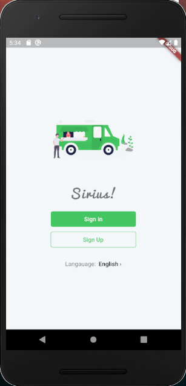
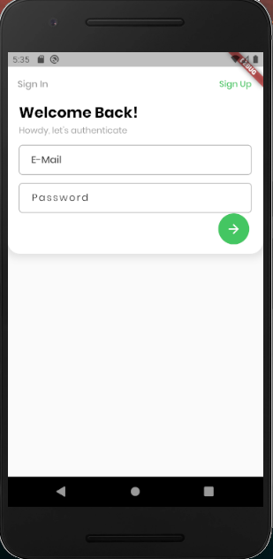
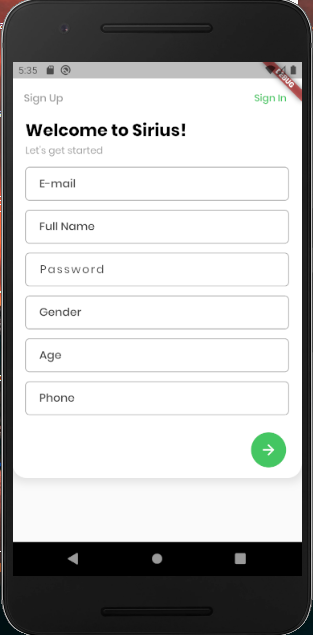
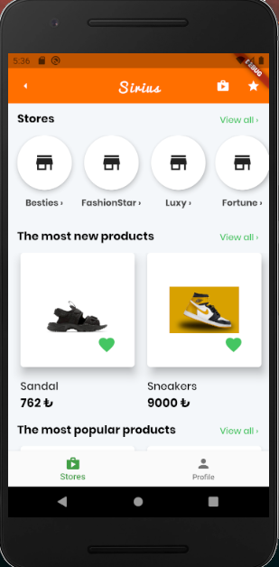
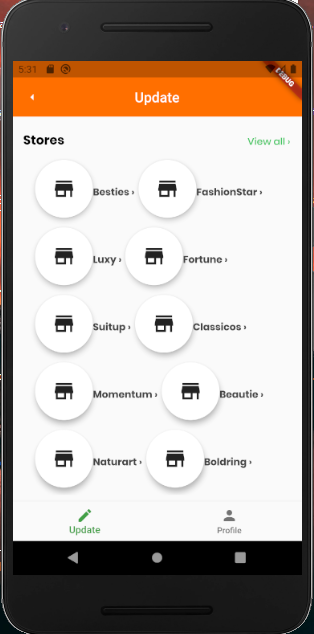
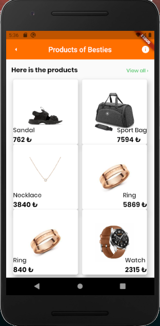
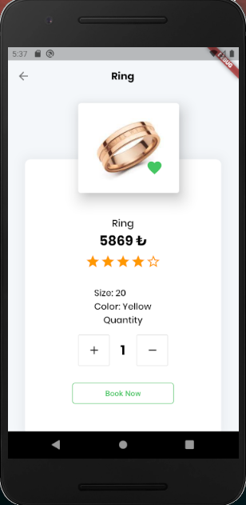
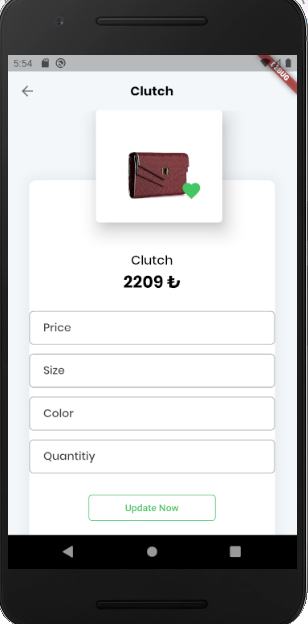
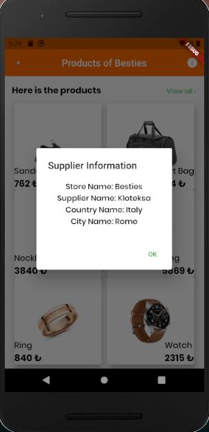
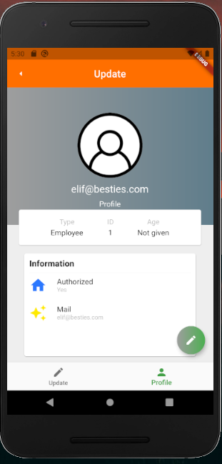

# SIRIUS MOBILE APP

A new Flutter application.

## Getting Started

After IDE analyzing the code run "pub get" to get related dependencies. You need to install XAMPP in your computer. Go to XAMPP htdocs folder and cut "database" folder from the project and paste there. Go to the xampp control panel and start Apache and MySQL from there. Notice that there shouldnt be any running mysql.exe in the bacckground before starting MySQL module of XAMPP. Then go to the your browser and type "http://localhost/phpmyadmin/index.php". Next you need to create a database called "final". Go to the SQL bench and take SQL file in this directory and load there. Later on you may go to the your terminal of the project and run "flutter run --no-sound-null-safety" to see the application

## Ideology
There are two types of users in this app such as client and salesperson. Salesperson of the app is able to update and remove any product from the database. Client is able to book any product under the condition of not exciding the 15 days. Otherwise app doesnt allow to book any product. There are 16 stores in the database and some related insertions for products and users already done. 

## Screenshots of APP
### Home && Login && Register Page

  
  
  

### Store Page for Clients && Update Page for Salesperson

  
    

### Products of A Store && Product Page for Client && Product Update Page for Salesperson

  
  
  

### Supplier Info Dialog and Profile Page for Client example

  
    

